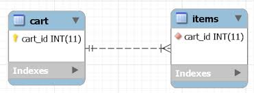
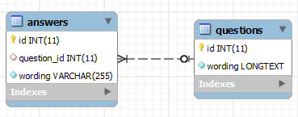

# Data definition

*  🔖 **Alteration**
*  🔖 **Relations**
*  🔖 **Migration**

___

## 📑 Alteration

🔗 [alter-table](https://dev.mysql.com/doc/refman/5.7/en/alter-table-examples.html)

Une fois crées vos tables peuvent être modifiées.

### 🏷️ **Modifier une colonne**

* Ajouter une colonne

```sql
ALTER TABLE my_table ADD COLUMN my_column INT) AFTER id;
```

* Supprimer une colonne

```sql
ALTER TABLE my_table DROP COLUMN my_column
```

* Modifier une colonne

Modifier la définition d'une colonne

```sql
ALTER TABLE my_table MODIFY id TINYINT;
```

Renommer une colonne

```sql
ALTER TABLE my_table CHANGE id other_id INT;
```

* Ajouter un index

```sql
ALTER TABLE my_table ADD INDEX (id), ADD UNIQUE id_u (id);
```

* Supprimer un index

```sql
ALTER TABLE my_table DROP INDEX id_u; 
```

___

## 📑 Relations

Les tables peuvent être mises en relations par le biais de leur indexes. Nous allons observer les différent types de relations possibles.

### 🏷️ **OneToMany**

Une relation OneToMany est un type de cardinalité qui fait référence à la relation entre deux entités A et B dans laquelle un élément de A peut être lié à de nombreux éléments de B, mais un membre de B est lié à un seul élément de A.



### 🏷️ **ManyToOne**

La relation ManyToOne est l'inverse de la relation OneToMany.



### 🏷️ **OneToOne**

Une relation OneToOne est un type de cardinalité qui fait référence à la relation entre deux entités A et B dans lequel un élément de A ne peut être lié qu'à un seul élément de B, et vice versa.


### 🏷️ **ManyToMany**

Une relation multivaleur détermine que pour chaque enregistrement d'une table, il peut y avoir aucun, un ou plusieurs enregistrements d'une autre table qui lui soit liés


___

👨🏻‍💻 Manipulation

Créer un Entity Relation Diagram de votre base de données.

___

## 📑 Migration

👨🏻‍💻 Manipulation

Modifiez vos tables pour mettre en place les relations de clefs étrangères. Puis exporter votre base de données dans un fichier sql.

___